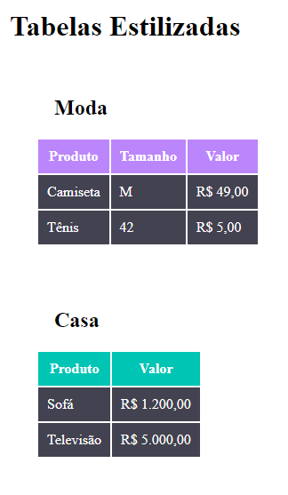

# 

<h1 align="center"> Primeiro Projeto Tela Login  </h1>

<h1>
    
</h1>

 <a href="https://llucasgomes.github.io/DevQuest-HtmlCssBasico/" target="_blank" >Click para Aqui</a>
# Indice

- [Sobre](#-sobre)
- [Tecnologias Utilizadas](#-tecnologias-utilizadas)

## 🔖&nbsp; Sobre

Esse é um Projeto onde faço uma tabela estilizada, onde utilizo HTML CSS básico, com o intuito de praticar o que venho estudando atualmente.

---

## 🚀 Tecnologias utilizadas

O projeto foi desenvolvido utilizando as seguintes tecnologias

- HTML
- CSS

---

Desenvolvido por Lucas Gomes